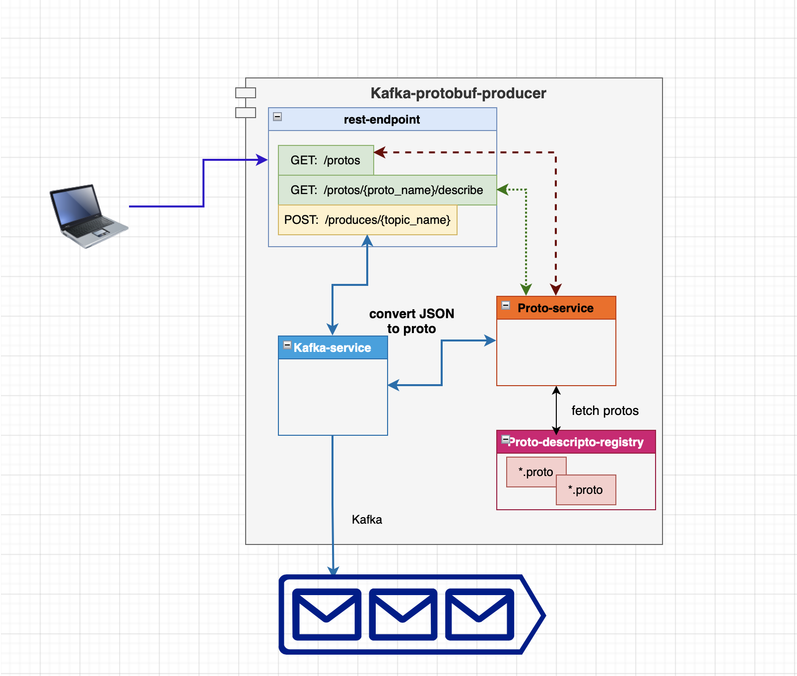

# Kafka prtobuf message producer

This project is used to produce protobuf messages message to given kafka topic

## UseCase

1. Integration testing
2. Debugging
3. Mocking proto messages

## Capabilities

- able to register protobug using proto-descriptor - one time
- able to discover all register protobuf message
- able to convert json to protobuf message dynamically, and send protobuf message to given topic

## Architecture Diagram 



## How to Use

0. Clone the repository into any folder/workspace you want

1. Step 1 : run the below shell-script to generate proto descriptor.pb file

   > ./gen-proto.sh

   make sure to run it form the directory that contain ./proto folder

2. Verify the file : proto/descriptor.pb should be generated to the respective folder

3. run `go build`

4. run `./kafka-protobuf-producer` or `go run main.go`

### Tests

> go test ./...

### Verify the Registered protos

```curl
curl -X GET localhost:8080/protos
```

### Get Proto contents

```curl
curl -X GET localhost:8080/protos/:protoNameFromAboveResponse/describe
```

### Produce Proto Massage to topic

```curl
curl -d '{"data": "eyJyZWNvcmRJZCI6IjAwMSIsICJjcmVhdGVkQXQiOiIyMDIxLTEyLTAyVDAwOjAwOjAwWiIsInVwZGF0ZWRCeSI6ICJuZWVyYWoifQ=="}' \
 -H "Content-Type: application/json" \
 -H "X-Proto-Message-Type: Record.proto" \
 -X POST localhost:8080/produces/:topicName
```

Note: _data is base64 encoded json string_

_Make sure protifile name and message name should be same - sake of simplicity_

## Header

| HEADER_NAME          | Description                                     | Mandatory?                      |
| -------------------- | ----------------------------------------------- | ------------------------------- |
| X-Proto-Message-Type | name of the proto to be used to produce message | if missing - produces pain/text |

### How to encode bas64 string from json

```sh
echo -ne \
 "{\"recordId\":\"001\", \"createdAt\":\"2021-12-02T00:00:00Z\",\"updatedBy\": \"neeraj\"}" | base64
```

## Configurations

Configuration is read from following environment variables

| Variable         | Description                 | Default Value         | Possible Values         |
| ---------------- | --------------------------- | --------------------- | ----------------------- |
| BOOTSTRAP_SERVER | kafka bootstrap server      | localhost:9092        | host post               |
| ACKS             | number of acks required     | 1                     | 1,2,all                 |
| CLIENT_ID        | client id                   | golang-clientid       | optional - keep default |
| PROTO_DESC_PATH  | file path for descriptor.pb | ./proto/descriptor.pb | filepath (volume mount) |

## Build and run

> docker build -t needubey/kafka-proto-producer:latest .

```sh
docker run --rm -it --name kafka-proto-producer \
-p 8080:8080 \
-e PROTO_DESC_PATH=/proto/descriptor.pb \
-v /proto:/proto \
needubey/kafka-proto-producer
```

Server is exposed on container port 8080

### [docker-compose](docker-compose.yaml)
